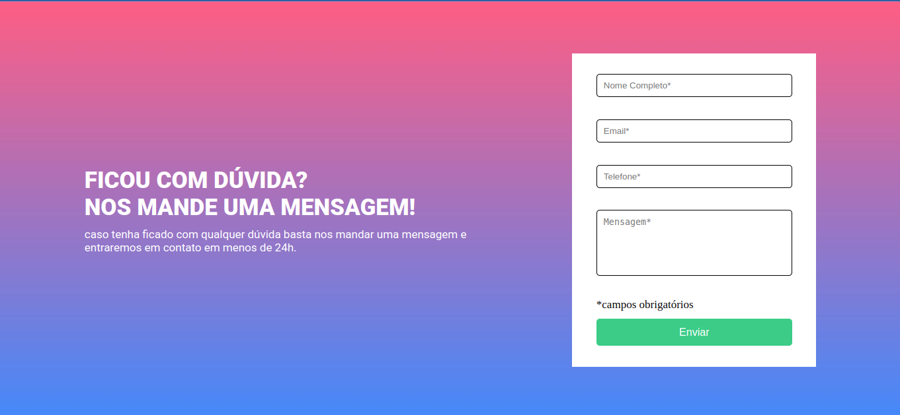

# 

<h1 align="center"> Formulário com Validação  </h1>

<h1>
    
</h1>

 
# Indice

- [Sobre](#-sobre)
- [Tecnologias Utilizadas](#-tecnologias-utilizadas)
- [Pagina](https://llucasgomes.github.io/Tela-Login-Star-Wars/)

## 🔖&nbsp; Sobre

Esse é um Desafio onde faço  uma page com formulario, onde utilizo HTML CSS JS, com o intuito de praticar o que venho estudando atualmente.

---

## 🚀 Tecnologias utilizadas

O projeto foi desenvolvido utilizando as seguintes tecnologias

- HTML
- CSS
- JQUERY (Javascript)

---

Desenvolvido por Lucas Gomes